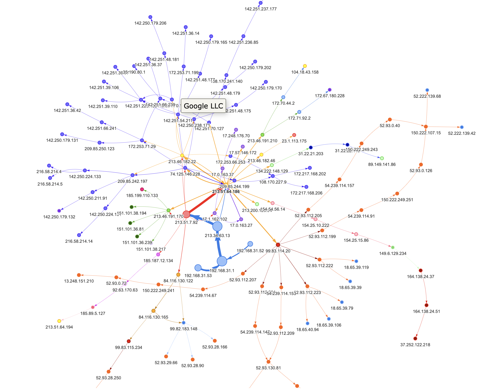

# Mycorrhizal Network

## Overview

<p float="left">
    
</p>

## Prerequisites

* Kubernetes 1.18+
* Helm 3.0+ ([installing helm](https://helm.sh/docs/intro/install/))
* Python 3.9
* Poetry ([installing poetry](https://python-poetry.org/))

## Part 1 🧠 - Install the `Kafka` cluster with `neo4j`

<ins>**Ensure that the server has at least `8GB` memory for Docker**</ins>

1. Install the `Kafka` cluster with the `neo4j` database:
```bash
helm repo add tintinrevient https://tintinrevient.github.io/helm-chart
helm repo update
helm install data-door-release tintinrevient/data-door-chart --namespace "data-door" --create-namespace
```

> :warning: If [0/1 nodes are available: 1 node(s) had taints that the pod didn't tolerate](https://github.com/calebhailey/homelab/issues/3), you can untaint the desired node using `kubectl taint nodes --all node-role.kubernetes.io/control-plane-`. This issue happens if you create a cluster with `kubeadm` and the master node is planned to be deployable as well.

> To install Kubernetes cluster with `kubeadm`, you can reference [this guide](https://github.com/tintinrevient/kubernetes-in-action#create-a-cluster-with-kubeadm).

2. Expose the following four services in the host machine:
```bash
kubectl port-forward svc/external-broker -n data-door 9093:9093 --address='0.0.0.0'
kubectl port-forward svc/control-center -n data-door 9021:9021
kubectl port-forward svc/neo4j -n data-door 7687:7687
kubectl port-forward svc/neo4j-web -n data-door 7474:7474
```

3. Access the control center via http://localhost:9021/ and create [this Neo4j connector](ksql/neo4j_traffic_sink.sql) in ksqlDB.

4. When finished, the environment can be nuked by the following command:
```bash
$ helm uninstall data-door-release --namespace "data-door"
```

## Part 2 🐙 - Install the `Kafka` producer with `scapy` 

1. Install all the dependencies:
```bash
poetry install
```

2. Run the packet sniffer to capture and dissect IP datagram:
```bash
poetry run network monitor_ip --broker="[local IP address of your exposed external Kafka broker]:9093"
```

3. Run `traceroute` to plot the inter-connected hops:
```bash
poetry run network trace_route --broker="[local IP address of your exposed external Kafka broker]:9093"
```

## Result

The inter-connected hops can be viewed in neovis via [this html](neovis/network-hops.html):
<p float="left">
    
</p>

## References
* https://en.wikipedia.org/wiki/Mycorrhizal_network
